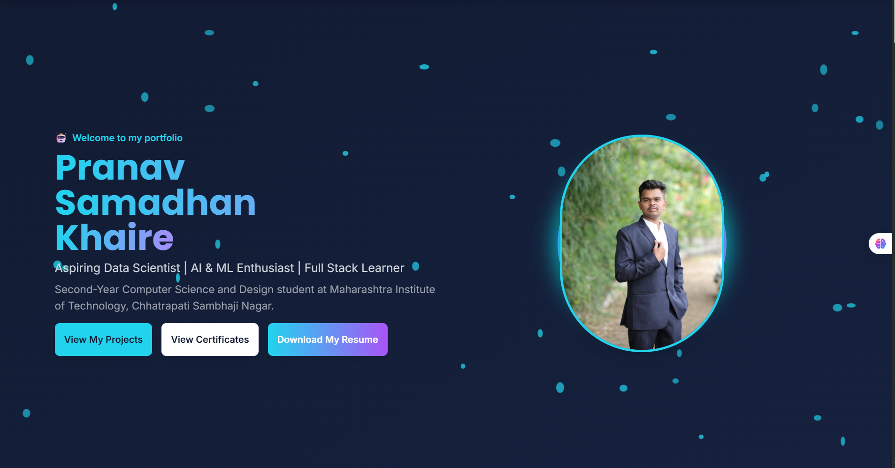

<h1 align="center">Hi 👋, I'm Pranav Samadhan Khaire</h1>
<h3 align="center">Aspiring Data Scientist • AI & ML Enthusiast • Full-Stack Learner</h3>

  <a href="https://pranav-portfolio16.netlify.app/" target="_blank">🌐 Portfolio</a> •
  <a href="mailto:pranavkhaire53@gmail.com" target="_blank">📧 Email</a> •
  <a href="https://github.com/pranav16-king" target="_blank">💻 GitHub</a>

  

---

## 🚀 About Me

I am **Pranav Samadhan Khaire**, a 2nd-year B.Tech student in **Computer Science & Design** at **Maharashtra Institute of Technology, Chhatrapati Sambhaji Nagar**.  
I build production-minded, data-driven systems and ML-enabled web applications with a focus on clean UX, maintainable backends, and pragmatic model deployments.

**Core interests & focus**
- 📊 Data Science & Advanced Analytics  
- 🤖 Machine Learning, AI & NLP  
- 🧬 Deep Learning fundamentals  
- 🗄️ Databases: MongoDB & MySQL  
- 🐳 Containerization & Deployment (Docker)  
- ⚙️ Backend APIs with Python & Flask  
- 🎨 Frontend using HTML, CSS, JavaScript & Tailwind

---

## 🗂 Projects
> All projects git hub links are live on my portfolio and available in my GitHub repos.

- Blue Carbon MRV System  
- PM Internship Allocator  
- Future Skills & AI Advisor  
- Agri Connect

---

## 🧭 Quick Highlights

- 🎓 **Education:** B.Tech — Computer Science & Design (2nd Year), MIT Chhatrapati Sambhaji Nagar  
- 🏆 **Selected Awards:**  
  - 1st Prize — Cogni-Sphere 2025 (IETE, MIT CSN) — Issued: 14 Oct 2025  
  - 2nd Prize — Sankalpana 2025 (District Level) — Issued: 15 Nov 2025  
- 📜 **30+ Certifications & Badges** — Microsoft, Oracle, Google Cloud, TCS iON, HCL, IBM, Simplilearn, HP LIFE, and more.  
- 🧩 **Projects:** 12+ (mix of ML, web apps, and full-stack systems)  
- 🔭 **Current learning path:** Advanced Data Science → ML → AI → Deep Learning

---

## 🛠️ Tech Stack & Tools

**Languages:** Python · JavaScript · SQL · HTML · CSS  
**Frontend:** Tailwind CSS · Responsive UI · Figma  
**Backend & APIs:** Flask · REST · Auth patterns  
**Data & ML:** NumPy · Pandas · scikit-learn · Matplotlib · NLP basics  
**Deep Learning:** TensorFlow · PyTorch (learning)  
**Databases:** MongoDB · MySQL · SQLite (prototyping)  
**Infra & DevOps:** Docker · GitHub Actions · Docker Hub / GHCR  
**Other tools:** OpenCV · GeoPandas · Jupyter Notebooks · VS Code

---

## 🏅 Certifications (selected)
- TCS iON — Career Edge (Young Professional) — Completed: 10 Nov 2025  
- Oracle — OCI AI Foundations Associate — Issued: 11 Nov 2025 (valid until 11 Nov 2027)  
- Microsoft & HCL — SOAR & Azure AI badges — Oct–Nov 2025  
- Google Cloud (Simplilearn) — Introduction to Generative AI — Issued: 30 Nov 2025  
- IBM SkillsBuild — AI Literacy (Verified Badge) — Issued: 26 Oct 2025  
- Many more (EDUCBA, HP LIFE, CodeWithHarry, Simplilearn, Unstop, SkillEcted)

---

# 🌐 Connect With Me

       

---

# 🛠️ Languages & Tools

---

# 📊 GitHub Analytics (New, More Accurate Providers)

### 🔸 **Contribution Streak**

## 🎉 Thanks for visiting my GitHub!  
⭐ **Feel free to star my repositories & connect with me!**

